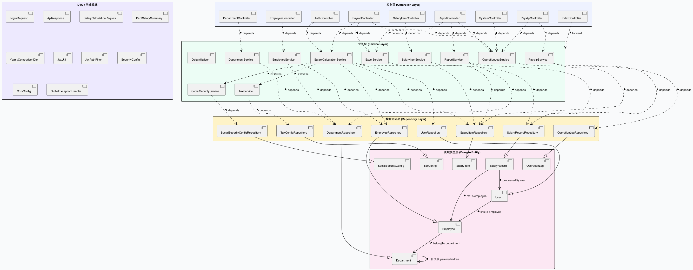
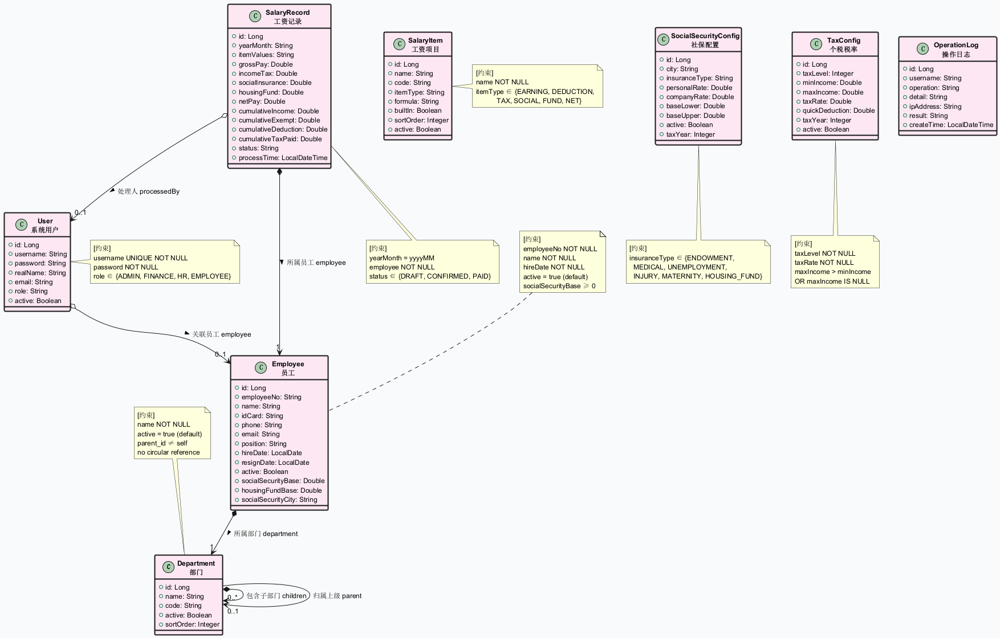
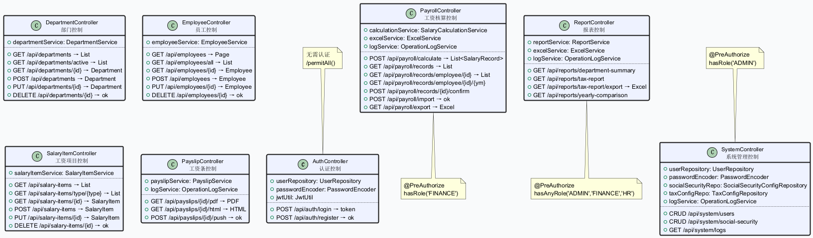
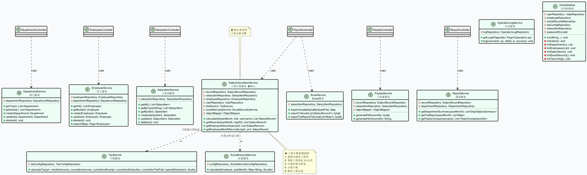
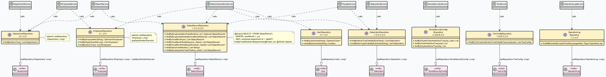
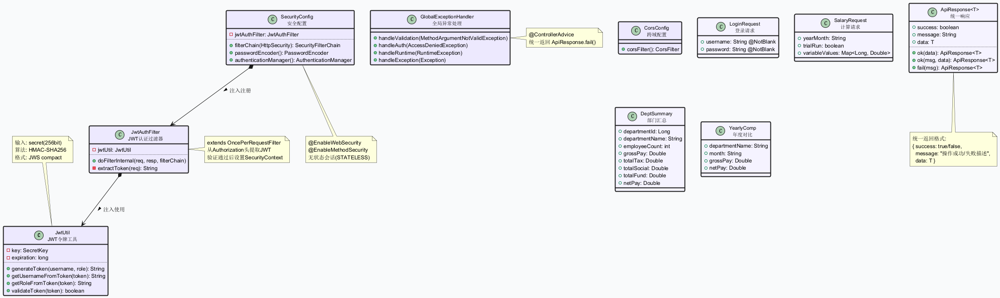

# 薪资管理系统 - 系统设计类图

## 1. 分层架构概览

系统采用 **四层架构**，自上而下依次为：控制层（Controller）→ 业务层（Service）→ 数据访问层（Repository）→ 领域模型层（Domain）。此外包含基础设施层（Security、Config、Exception）和传输对象层（DTO）。



**分层依赖方向（箭头表示依赖关系）：**

| 层级 | 关系符号 | 关系类型 | 说明 |
|------|---------|---------|------|
| Controller → Service | `..>` 虚线箭头 | **依赖 (Dependency)** | 控制层依赖业务层处理请求，共 **13 条依赖** |
| Service → Repository | `..>` 虚线箭头 | **依赖 (Dependency)** | 业务层依赖 Repository 持久化数据，共 **15 条依赖** |
| Service → Service | `..>` 虚线箭头 | **依赖 (Dependency)** | SalaryCalculationService 依赖 TaxService（个税计算）和 SocialSecurityService（社保核算） |
| Repository → Entity | `--|>` 空心三角 | **泛化 (Generalization/Implements)** | 8 个 Repository 实现对应的 JPA 实体泛型参数 |
| Entity ↔ Entity | `-->` / `*-->` / `o-->` 实线箭头 | **关联 (Association)** | 实体间的组合、聚合、引用关系（详见领域模型章节） |

**各层数量统计：**

| 层 | 类/接口数量 | 涉及的类 |
|----|-----------|---------|
| 控制层 (Controller) | 9 | AuthController, DepartmentController, EmployeeController, SalaryItemController, PayrollController, PayslipController, ReportController, SystemController, IndexController |
| 业务层 (Service) | 11 | DepartmentService, EmployeeService, SalaryItemService, SalaryCalculationService, TaxService, SocialSecurityService, ExcelService, PayslipService, ReportService, OperationLogService, DataInitializer |
| 数据访问层 (Repository) | 8 | DepartmentRepository, EmployeeRepository, UserRepository, SalaryItemRepository, SalaryRecordRepository, SocialSecurityConfigRepository, TaxConfigRepository, OperationLogRepository |
| 领域模型层 (Domain) | 8 | Department, Employee, User, SalaryItem, SalaryRecord, SocialSecurityConfig, TaxConfig, OperationLog |
| 传输对象层 (DTO) | 5 | LoginRequest, ApiResponse<T>, SalaryCalculationRequest, DeptSalarySummary, YearlyComparisonDto |
| 基础设施层 | 5 | JwtUtil, JwtAuthFilter, SecurityConfig, CorsConfig, GlobalExceptionHandler |

---

## 2. 领域模型层（实体类）

领域模型包含 8 个实体类，涵盖组织架构、薪资计算、系统管理三大领域。



### 实体间关系分类

| 关系类型 | PlantUML 符号 | 意义 |
|---------|--------------|------|
| **组合 (Composition)** | `*-->` 实心菱形+实线箭头 | 子对象不能独立于父对象存在 |
| **聚合 (Aggregation)** | `o-->` 空心菱形+实线箭头 | 子对象可以独立于父对象存在 |
| **关联 (Association)** | `-->` 实线箭头 | 对象间的结构化引用关系 |
| **自关联 (Self-association)** | `*-->` 自身引用 | 同一类型的层次结构关系 |

### 实体关联详表

| 源实体 | 目标实体 | 关系符号 | 多重性 | 角色名/外键 | 说明 |
|--------|---------|---------|--------|-----------|------|
| Department | Department | `*-->` **组合** | `1` → `0..*` | children（子部门集合） | 部门包含子部门，级联操作 |
| Department | Department | `-->` | `0..1` → `1` | parent_id（上级部门） | 部门归属上级，自引用树结构 |
| Employee | Department | `*-->` **组合** | `*` → `1` | department_id（所属部门外键） | 员工必须属于一个部门，NOT NULL |
| User | Employee | `o-->` **聚合** | `*` → `0..1` | employee_id（关联员工） | 用户可选关联员工实体 |
| SalaryRecord | Employee | `*-->` **组合** | `*` → `1` | employee_id（员工外键） | 工资记录必须归属员工，NOT NULL |
| SalaryRecord | User | `o-->` **聚合** | `*` → `0..1` | processed_by（处理人） | 工资记录可选记录处理人 |

### 约束条件

| 实体 | 约束 |
|------|------|
| Department | name NOT NULL；active 默认 true；parent_id 不可指向自身；不可形成环路 |
| Employee | employeeNo NOT NULL, name NOT NULL, hireDate NOT NULL；active 默认 true；socialSecurityBase ≥ 0 |
| User | username UNIQUE NOT NULL；password NOT NULL；role ∈ {ADMIN, FINANCE, HR, EMPLOYEE} |
| SalaryItem | name NOT NULL；itemType ∈ {EARNING, DEDUCTION, TAX, SOCIAL, FUND, NET} |
| SalaryRecord | yearMonth = yyyyMM；employee NOT NULL；status ∈ {DRAFT, CONFIRMED, PAID} |
| SocialSecurityConfig | insuranceType ∈ {ENDOWMENT, MEDICAL, UNEMPLOYMENT, INJURY, MATERNITY, HOUSING_FUND} |
| TaxConfig | taxLevel NOT NULL；taxRate NOT NULL；maxIncome > minIncome OR maxIncome IS NULL（末级无上限） |
| OperationLog | username NOT NULL；operation NOT NULL；result NOT NULL |

---

## 3. 控制层（Controller）

控制层包含 9 个 Controller，负责接收 HTTP 请求、参数校验和权限控制。每个 Controller 通过**依赖注入**方式调用对应的 Service 类。



### Controller 与 API 映射

| Controller | 依赖的 Service | API 端点 | 权限注解 |
|-----------|---------------|---------|---------|
| AuthController | JwtUtil, PasswordEncoder | POST `/api/auth/login`、POST `/api/auth/register` | permitAll() |
| DepartmentController | DepartmentService | GET/POST/PUT/DELETE `/api/departments[/{id}]` | 认证用户 |
| EmployeeController | EmployeeService | GET/POST/PUT/DELETE `/api/employees[/{id}]` | 认证用户 |
| SalaryItemController | SalaryItemService | GET/POST/PUT/DELETE `/api/salary-items[/{id}]` | 认证用户 |
| PayrollController | SalaryCalculationService, ExcelService, OperationLogService | POST `/api/payroll/calculate`、GET `/api/payroll/records`、POST `/api/payroll/import`、GET `/api/payroll/export` | @PreAuthorize hasRole('FINANCE') |
| PayslipController | PayslipService, OperationLogService | GET `/api/payslips/{id}/pdf`、GET `/api/payslips/{id}/html`、POST `/api/payslips/{id}/push` | push 需 FINANCE 角色 |
| ReportController | ReportService, ExcelService, OperationLogService | GET `/api/reports/department-summary`、GET `/api/reports/tax-report`、GET `/api/reports/tax-report/export`、GET `/api/reports/yearly-comparison` | @PreAuthorize hasAnyRole('ADMIN','FINANCE','HR') |
| SystemController | UserRepository, SocialSecurityConfigRepository, TaxConfigRepository, OperationLogService | CRUD `/api/system/users`、CRUD `/api/system/social-security`、GET `/api/system/logs` | @PreAuthorize hasRole('ADMIN') |
| IndexController | (转发) | GET `/` → forward: index.html | permitAll() |

### 权限矩阵

| 角色 | 可访问的功能 |
|------|-------------|
| **ADMIN**（管理员） | 全部功能：组织架构、员工、工资项目、工资核算、工资条、报表、用户管理、社保配置、日志 |
| **FINANCE**（财务） | 工资核算（计算/确认/导入/导出）、工资条推送、社保配置、部门汇总、个税报表 |
| **HR**（人事） | 部门管理、员工管理、工资项目查看、工资记录查看、部门汇总报表 |
| **EMPLOYEE**（员工） | 查看个人工资条（PDF/HTML）、查看个人工资记录 |

---

## 4. 业务服务层（Service）

业务层包含 11 个 Service，实现核心业务逻辑。其中 `SalaryCalculationService` 是系统的**核心业务类**，负责工资计算引擎的完整流程编排。



### Service 依赖关系

| 调用方（Controller） | 被调用方（Service） | 关系类型 |
|--------------------|-------------------|---------|
| DepartmentController | → DepartmentService | 依赖注入 |
| EmployeeController | → EmployeeService | 依赖注入 |
| SalaryItemController | → SalaryItemService | 依赖注入 |
| PayrollController | → SalaryCalculationService | 依赖注入 |
| PayrollController | → ExcelService | 依赖注入 |
| PayslipController | → PayslipService | 依赖注入 |
| ReportController | → ReportService | 依赖注入 |

### Service 内部依赖（Service → Service）

| 调用方 | 被调用方 | 说明 |
|--------|---------|------|
| SalaryCalculationService | → TaxService | 个税累计预扣法计算 |
| SalaryCalculationService | → SocialSecurityService | 社保公积金核算 |

### 核心业务流：工资计算完整链路

```
PayrollController (POST /api/payroll/calculate)
     │
     ▼
SalaryCalculationService.calculateAll(yearMonth, trial, username)
     │
     ├──→ EmployeeRepository.findAll()  ──→ 获取全部在职员工
     │
     ├──→ SalaryItemRepository.findAll() ──→ 获取工资项定义 + 计算公式
     │
     ├──→ SocialSecurityService.calculate(employee, yearMonth)
     │         │
     │         └──→ SocialSecurityConfigRepository.findByCityAndYearAndActiveTrue()
     │               └── 返回: { endowment, medical, unemployment, housingFund }
     │
     ├──→ TaxService.calculateTax(yearMonth, income, cumulative...)
     │         │
     │         └──→ TaxConfigRepository.findByTaxYearAndActiveTrueOrderByTaxLevel()
     │               └── 累计预扣法: 应纳税所得额 × 税率 － 速算扣除数 － 已缴税款
     │
     └──→ SalaryRecordRepository.save(record)
           └── 写入: grossPay, socialInsurance, housingFund, incomeTax, netPay, status
```

---

## 5. 数据访问层（Repository）

数据访问层包含 8 个 Repository 接口，全部继承 Spring Data JPA 提供的 `JpaRepository<Entity, Long>` 基接口。通过泛型参数声明与实体的**实现关系（Generalization）**。



### Repository 与实体的泛化关系

| Repository 接口 | 泛化目标实体 | 额外继承接口 | 自定义查询方法 |
|---------------|------------|-------------|--------------|
| DepartmentRepository | Department | — | findByActiveTrue |
| EmployeeRepository | Employee | **JpaSpecificationExecutor** | findByEmployeeNo, findByDepartmentId, findByActiveTrue |
| UserRepository | User | — | findByUsername, existsByUsername |
| SalaryItemRepository | SalaryItem | — | findByActiveTrueOrderBySortOrder, findByItemTypeOrderBySortOrder |
| SalaryRecordRepository | SalaryRecord | — | findByEmployeeIdAndYearMonth, findByYearMonth, findByYearMonthAndStatus, **findByYearMonthAndDepartment**(@Query), findDistinctYearMonths, findByEmployeeAndYearPrefix |
| SocialSecurityConfigRepository | SocialSecurityConfig | — | findByCityAndYearAndActiveTrue, findByYearAndActiveTrue, findByCityAndActiveTrue |
| TaxConfigRepository | TaxConfig | — | findByTaxYearAndActiveTrueOrderByTaxLevel |
| OperationLogRepository | OperationLog | — | findAllByOrderByCreateTimeDesc |

### Service 对 Repository 的调用依赖

| Service | 调用的 Repository |
|---------|-----------------|
| DepartmentService | DepartmentRepository |
| EmployeeService | EmployeeRepository, DepartmentRepository |
| SalaryItemService | SalaryItemRepository |
| SalaryCalculationService | SalaryRecordRepository, SalaryItemRepository, EmployeeRepository, UserRepository |
| TaxService | TaxConfigRepository |
| SocialSecurityService | SocialSecurityConfigRepository |
| ExcelService | SalaryItemRepository |
| PayslipService | SalaryRecordRepository, SalaryItemRepository |
| ReportService | SalaryRecordRepository, DepartmentRepository |
| OperationLogService | OperationLogRepository |

---

## 6. 基础设施与 DTO

基础设施层提供安全认证、跨域、异常处理等横切关注点。DTO 层定义接口传输对象。关键类间为**组合注入关系**（SecurityConfig 包含 JwtAuthFilter，JwtAuthFilter 包含 JwtUtil）。



### 基础设施类

| 类 | 关系类型 | 功能说明 |
|----|---------|---------|
| **JwtUtil** | — | JWT 令牌生成/解析/校验。输入 256bit secret，HMAC-SHA256 签名，JWS compact 格式 |
| **JwtAuthFilter** | `◆--> JwtUtil` **组合注入** | extends OncePerRequestFilter。从 Authorization Header 提取 Bearer token，解析后设置 SecurityContext |
| **SecurityConfig** | `◆--> JwtAuthFilter` **组合注入** | @EnableWebSecurity + @EnableMethodSecurity。配置无状态会话、CORS、RBAC 规则。注册 JwtAuthFilter 到过滤链 |
| **CorsConfig** | — | 跨域请求配置，允许前端 SPA 跨域调用 API |
| **GlobalExceptionHandler** | — | @ControllerAdvice 统一异常处理，校验异常/认证异常/运行时异常均返回 ApiResponse.fail() |

### DTO 类

| 类 | 用途 | 关键字段 |
|----|------|---------|
| **ApiResponse<T>** | 统一响应体（泛型） | success, message, data；含 ok()/fail() 工厂方法 |
| **LoginRequest** | 登录请求 | username @NotBlank, password @NotBlank |
| **SalaryCalculationRequest** | 工资计算请求 | yearMonth, trialRun, variableValues |
| **DeptSalarySummary** | 部门工资汇总 DTO | departmentId, departmentName, employeeCount, grossPay, totalTax, totalSocial, totalFund, netPay |
| **YearlyComparisonDto** | 年度对比 DTO | departmentName, month, grossPay, netPay |

---

## 7. 设计决策说明

| 决策项 | 选择 | 关系影响 | 理由 |
|--------|------|---------|------|
| 关联类映射 | SocialSecurityConfig 作为独立实体 | 原为城市×险种×年份的关联类，现映射为独立实体，与其他实体无直接关联（Repository 单独查询） | 社保配置独立变更，不依附于员工实体 |
| 关联方向 | 全部单向（N:1） | 图中所有关联箭头均为单向，无双向关联 | 避免序列化和延迟加载复杂性，通过 Repository 反向查询 |
| 树形结构 | Department 自关联（parent_id） | 自关联组合关系 `*--> 0..*` Department | 支持无限层级，通过 parent_id + children 集合实现级联 |
| 实体完整性 | @PrePersist / @PreUpdate | 所有实体自动维护时间戳，不表现为关联关系 | 自动记录创建和更新时间，避免手动维护 |
| 逻辑删除 | active 布尔字段 | Department/Employee/SalaryItem 使用软删除，不影响关联的 SalaryRecord 历史数据 | 保护数据完整性，工资记录仍需引用已删除的部门/员工 |

### 关系类型索引

| PlantUML 符号 | 关系类型 | 图中使用次数 | 使用场景 |
|--------------|---------|------------|---------|
| `..>` | 依赖 (Dependency) | 31 | Controller→Service, Service→Repository, Service→Service |
| `--|>` | 泛化 (Generalization) | 8 | Repository implements JpaRepository&lt;Entity&gt; |
| `*-->` | 组合 (Composition) | 4 | Department→children, Employee→Department, SalaryRecord→Employee |
| `o-->` | 聚合 (Aggregation) | 2 | User→Employee, SalaryRecord→User |
| `-->` | 关联 (Association) | 1 | Department→parent（自引用） |

---

*文档生成日期：2026-06-23*
*对应代码版本：薪资管理系统 v1.0.0*

**图片源文件：** `uml/` 目录下的 `.puml` 文件可用 PlantUML 重新生成
