# 薪资管理系统 - 系统设计类详细说明

> 本文档按照 **实体类 (Entity)**、**业务服务类 (Service)**、**控制类 (Controller)** 的分类原则，对系统设计类图中包含的所有类进行完整的 UML 规范描述。

---

## 第一类：实体类 (Entity)

### 1.1 Department（部门）

**表名：** `sys_department`

**UML 表示：**

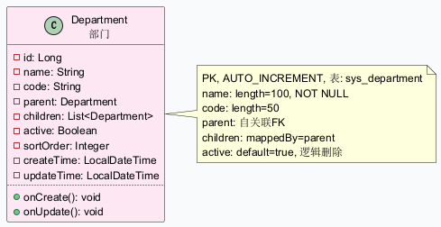

**属性说明：**

| 属性名称 | 数据类型 | 长度 | 默认值 | 约束 | 说明 |
|---------|---------|------|--------|------|------|
| id | Long | — | — | PK, AUTO_INCREMENT | 部门唯一标识符 |
| name | String | 100 | — | NOT NULL | 部门名称 |
| code | String | 50 | — | 可选 | 部门编码（如 TECH、SALES） |
| parent | Department | — | — | 可选，FK→Department.id | 上级部门（自关联，构成树形结构） |
| children | List\<Department\> | — | new ArrayList<>() | 可选 | 子部门列表（mappedBy="parent"） |
| active | Boolean | — | true | NOT NULL | 是否启用（逻辑删除标志） |
| sortOrder | Integer | — | — | 可选 | 排序号（越小越靠前） |
| createTime | LocalDateTime | — | — | updatable = false | 创建时间 |
| updateTime | LocalDateTime | — | — | — | 更新时间 |

**操作说明：**

| 操作名称 | 参数说明 | 返回值类型 | 说明 |
|---------|---------|-----------|------|
| onCreate | 无 | void | @PrePersist 生命周期回调。自动设置 createTime = now(), updateTime = now() |
| onUpdate | 无 | void | @PreUpdate 生命周期回调。自动设置 updateTime = now() |

---

### 1.2 Employee（员工）

**表名：** `sys_employee`

**UML 表示：**

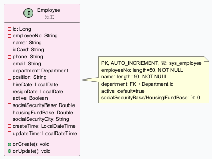

**属性说明：**

| 属性名称 | 数据类型 | 长度 | 默认值 | 约束 | 说明 |
|---------|---------|------|--------|------|------|
| id | Long | — | — | PK, AUTO_INCREMENT | 员工唯一标识符 |
| employeeNo | String | 50 | — | NOT NULL | 员工工号 |
| name | String | 50 | — | NOT NULL | 员工姓名 |
| idCard | String | 20 | — | 可选 | 身份证号码 |
| phone | String | 20 | — | 可选 | 手机号码 |
| email | String | 100 | — | 可选 | 电子邮箱 |
| department | Department | — | — | FK→Department.id | 所属部门（ManyToOne） |
| position | String | 20 | — | 可选 | 岗位名称 |
| hireDate | LocalDate | — | — | NOT NULL | 入职日期 |
| resignDate | LocalDate | — | — | 可选 | 离职日期 |
| active | Boolean | — | true | NOT NULL | 是否在职（逻辑删除标志） |
| socialSecurityBase | Double | — | — | ≥ 0 | 社保缴费基数 |
| housingFundBase | Double | — | — | ≥ 0 | 公积金缴费基数 |
| socialSecurityCity | String | 100 | — | 可选 | 社保缴纳城市（如"北京"、"上海"） |
| createTime | LocalDateTime | — | — | updatable = false | 创建时间 |
| updateTime | LocalDateTime | — | — | — | 更新时间 |

**操作说明：**

| 操作名称 | 参数说明 | 返回值类型 | 说明 |
|---------|---------|-----------|------|
| onCreate | 无 | void | @PrePersist 回调。自动设置 createTime = now(), updateTime = now() |
| onUpdate | 无 | void | @PreUpdate 回调。自动设置 updateTime = now() |

---

### 1.3 User（系统用户）

**表名：** `sys_user`

**UML 表示：**

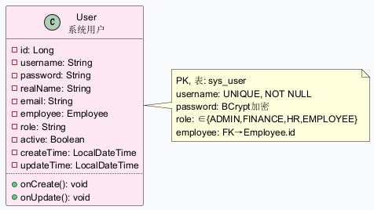

**属性说明：**

| 属性名称 | 数据类型 | 长度 | 默认值 | 约束 | 说明 |
|---------|---------|------|--------|------|------|
| id | Long | — | — | PK, AUTO_INCREMENT | 用户唯一标识符 |
| username | String | 50 | — | NOT NULL, UNIQUE | 登录用户名 |
| password | String | 200 | — | NOT NULL | 登录密码（BCrypt 加密存储） |
| realName | String | 50 | — | 可选 | 用户真实姓名 |
| email | String | 100 | — | 可选 | 电子邮箱 |
| employee | Employee | — | — | FK→Employee.id, 可选 | 关联的员工实体（ManyToOne） |
| role | String | 30 | — | NOT NULL, ∈{ADMIN,FINANCE,HR,EMPLOYEE} | 用户角色 |
| active | Boolean | — | true | NOT NULL | 是否启用 |
| createTime | LocalDateTime | — | — | updatable = false | 创建时间 |
| updateTime | LocalDateTime | — | — | — | 更新时间 |

**操作说明：**

| 操作名称 | 参数说明 | 返回值类型 | 说明 |
|---------|---------|-----------|------|
| onCreate | 无 | void | @PrePersist 回调。自动设置 createTime = now(), updateTime = now() |
| onUpdate | 无 | void | @PreUpdate 回调。自动设置 updateTime = now() |

---

### 1.4 SalaryItem（工资项目）

**表名：** `sys_salary_item`

**UML 表示：**

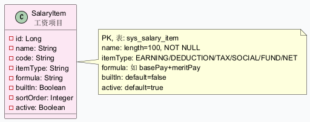

**属性说明：**

| 属性名称 | 数据类型 | 长度 | 默认值 | 约束 | 说明 |
|---------|---------|------|--------|------|------|
| id | Long | — | — | PK, AUTO_INCREMENT | 工资项目唯一标识符 |
| name | String | 100 | — | NOT NULL | 项目名称（如"基本工资"、"个人所得税"） |
| code | String | 50 | — | 可选 | 项目编码（用于公式引用，如 basePay） |
| itemType | String | 30 | — | NOT NULL, ∈{EARNING,DEDUCTION,TAX,SOCIAL,FUND,NET} | 项目类型：应发项/扣款项/个税/社保/公积金/实发 |
| formula | String | 500 | — | 可选 | 计算公式，支持使用 code 引用其他项目（如 basePay+meritPay） |
| builtIn | Boolean | — | false | NOT NULL | 是否系统内置（内置项不可删除） |
| sortOrder | Integer | — | — | 可选 | 排序号 |
| active | Boolean | — | true | NOT NULL | 是否启用 |

**操作说明：** 无自定义操作方法（仅使用 Lombok 生成的 getter/setter）

---

### 1.5 SalaryRecord（工资记录）

**表名：** `sal_salary_record`

**UML 表示：**

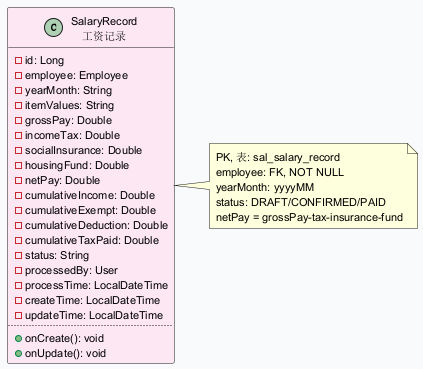

**属性说明：**

| 属性名称 | 数据类型 | 长度 | 默认值 | 约束 | 说明 |
|---------|---------|------|--------|------|------|
| id | Long | — | — | PK, AUTO_INCREMENT | 工资记录唯一标识符 |
| employee | Employee | — | — | NOT NULL, FK→Employee.id | 所属员工（ManyToOne） |
| yearMonth | String | 6 | — | NOT NULL, 格式: yyyyMM | 工资所属年月 |
| itemValues | String | TEXT | — | 可选, JSON 格式 | 各工资项的明细值（JSON 字符串） |
| grossPay | Double | — | — | ≥ 0 | 应发合计金额 |
| incomeTax | Double | — | — | ≥ 0 | 个人所得税金额 |
| socialInsurance | Double | — | — | ≥ 0 | 社保个人缴纳金额 |
| housingFund | Double | — | — | ≥ 0 | 公积金个人缴纳金额 |
| netPay | Double | — | — | ≥ 0 | 实发合计金额（netPay = grossPay - incomeTax - socialInsurance - housingFund） |
| cumulativeIncome | Double | — | — | ≥ 0 | 本年度累计收入（个税计算用） |
| cumulativeExempt | Double | — | — | ≥ 0 | 本年度累计免税收入 |
| cumulativeDeduction | Double | — | — | ≥ 0 | 本年度累计专项扣除 |
| cumulativeTaxPaid | Double | — | — | ≥ 0 | 本年度累计已缴税款 |
| status | String | 20 | — | NOT NULL, ∈{DRAFT,CONFIRMED,PAID} | 记录状态：试算/已确认/已发放 |
| processedBy | User | — | — | FK→User.id, 可选 | 处理人（ManyToOne） |
| processTime | LocalDateTime | — | — | 可选 | 处理时间 |
| createTime | LocalDateTime | — | — | updatable = false | 创建时间 |
| updateTime | LocalDateTime | — | — | — | 更新时间 |

**操作说明：**

| 操作名称 | 参数说明 | 返回值类型 | 说明 |
|---------|---------|-----------|------|
| onCreate | 无 | void | @PrePersist 回调。自动设置 createTime = now(), updateTime = now() |
| onUpdate | 无 | void | @PreUpdate 回调。自动设置 updateTime = now() |

---

### 1.6 SocialSecurityConfig（社保配置）

**表名：** `sys_social_security_config`

**UML 表示：**

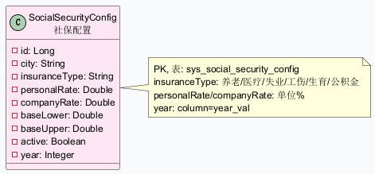

**属性说明：**

| 属性名称 | 数据类型 | 长度 | 默认值 | 约束 | 说明 |
|---------|---------|------|--------|------|------|
| id | Long | — | — | PK, AUTO_INCREMENT | 社保配置唯一标识符 |
| city | String | 100 | — | 可选 | 城市名称（空表示默认配置） |
| insuranceType | String | 30 | — | NOT NULL, ∈{ENDOWMENT,MEDICAL,UNEMPLOYMENT,INJURY,MATERNITY,HOUSING_FUND} | 险种类型：养老/医疗/失业/工伤/生育/公积金 |
| personalRate | Double | — | — | NOT NULL, 单位: % | 个人缴纳比例 |
| companyRate | Double | — | — | NOT NULL, 单位: % | 单位缴纳比例 |
| baseLower | Double | — | — | ≥ 0 | 缴费基数下限 |
| baseUpper | Double | — | — | ≥ 0 | 缴费基数上限 |
| active | Boolean | — | true | NOT NULL | 是否启用 |
| year | Integer (列名: year_val) | — | — | NOT NULL | 生效年份 |

**操作说明：** 无自定义操作方法

---

### 1.7 TaxConfig（个税税率配置）

**表名：** `sys_tax_config`

**UML 表示：**

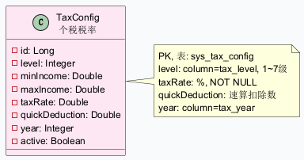

**属性说明：**

| 属性名称 | 数据类型 | 长度 | 默认值 | 约束 | 说明 |
|---------|---------|------|--------|------|------|
| id | Long | — | — | PK, AUTO_INCREMENT | 税率配置唯一标识符 |
| level | Integer (列名: tax_level) | — | — | NOT NULL | 税率级数（1~7 级） |
| minIncome | Double (列名: min_income) | — | — | ≥ 0 | 本级下限（含） |
| maxIncome | Double (列名: max_income) | — | — | > minIncome 或 NULL（末级） | 本级上限（不含） |
| taxRate | Double (列名: tax_rate) | — | — | NOT NULL, 单位: % | 税率百分比 |
| quickDeduction | Double (列名: quick_deduction) | — | — | ≥ 0 | 速算扣除数 |
| year | Integer (列名: tax_year) | — | — | NOT NULL | 生效年份 |
| active | Boolean (列名: active) | — | true | NOT NULL | 是否启用 |

**操作说明：** 无自定义操作方法

---

### 1.8 OperationLog（操作日志）

**表名：** `sys_operation_log`

**UML 表示：**

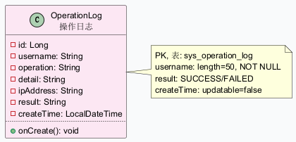

**属性说明：**

| 属性名称 | 数据类型 | 长度 | 默认值 | 约束 | 说明 |
|---------|---------|------|--------|------|------|
| id | Long | — | — | PK, AUTO_INCREMENT | 日志唯一标识符 |
| username | String | 50 | — | NOT NULL | 操作用户名 |
| operation | String | 50 | — | NOT NULL | 操作类型（如"工资计算"、"新增用户"） |
| detail | String | 200 | — | 可选 | 操作详情描述 |
| ipAddress | String | 50 | — | 可选 | 操作来源 IP 地址 |
| result | String | 20 | — | NOT NULL, ∈{SUCCESS,FAILED} | 操作结果 |
| createTime | LocalDateTime | — | — | updatable = false | 操作时间 |

**操作说明：**

| 操作名称 | 参数说明 | 返回值类型 | 说明 |
|---------|---------|-----------|------|
| onCreate | 无 | void | @PrePersist 回调。自动设置 createTime = now() |

---

## 第二类：业务服务类 (Service)

### 2.1 DepartmentService（部门服务）

**UML 表示：**

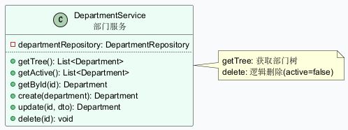

**属性说明：**

| 属性名称 | 数据类型 | 可见性 | 说明 |
|---------|---------|--------|------|
| departmentRepository | DepartmentRepository | private (final) | 部门数据仓库，Spring 注入 |

**操作说明：**

| 操作名称 | 参数说明 | 返回值 | 说明 |
|---------|---------|-------|------|
| getTree | 无参数 | List\<Department\> | 获取所有部门的树形结构 |
| getActive | 无参数 | List\<Department\> | 获取所有启用的部门列表 |
| getById | id: Long - 部门ID | Department | 根据 ID 获取部门；不存在则抛异常 |
| create | department: Department - 部门实体 | Department | 创建新部门 |
| update | id: Long - 部门ID; dto: Department - 更新数据 | Department | 更新部门信息（名称、编码、上级、排序） |
| delete | id: Long - 部门ID | void | 逻辑删除部门（设置 active = false） |

---

### 2.2 EmployeeService（员工服务）

**UML 表示：**

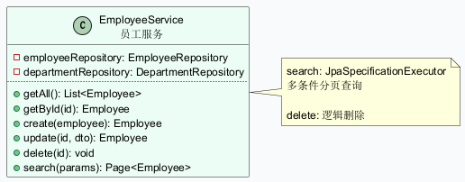

**属性说明：**

| 属性名称 | 数据类型 | 可见性 | 说明 |
|---------|---------|--------|------|
| employeeRepository | EmployeeRepository | private (final) | 员工数据仓库，Spring 注入 |
| departmentRepository | DepartmentRepository | private (final) | 部门数据仓库，Spring 注入 |

**操作说明：**

| 操作名称 | 参数说明 | 返回值 | 说明 |
|---------|---------|-------|------|
| getAll | 无参数 | List\<Employee\> | 获取所有员工列表 |
| getById | id: Long - 员工ID | Employee | 根据 ID 获取员工 |
| create | employee: Employee - 员工实体 | Employee | 创建新员工 |
| update | id: Long - 员工ID; dto: Employee - 更新数据 | Employee | 更新员工信息 |
| delete | id: Long - 员工ID | void | 逻辑删除员工（设置 active = false） |
| search | params: Map\<String, String\> - 查询条件（姓名、工号、部门ID等） | Page\<Employee\> | 多条件分页查询（JpaSpecificationExecutor） |

---

### 2.3 SalaryItemService（工资项目服务）

**UML 表示：**

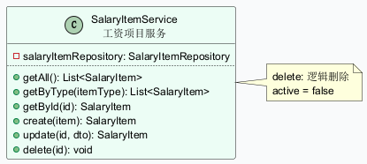

**属性说明：**

| 属性名称 | 数据类型 | 可见性 | 说明 |
|---------|---------|--------|------|
| salaryItemRepository | SalaryItemRepository | private (final) | 工资项目数据仓库，Spring 注入 |

**操作说明：**

| 操作名称 | 参数说明 | 返回值 | 说明 |
|---------|---------|-------|------|
| getAll | 无参数 | List\<SalaryItem\> | 获取所有启用的工资项目（按排序号升序） |
| getByType | itemType: String - 项目类型（EARNING/DEDUCTION 等） | List\<SalaryItem\> | 按类型获取工资项目列表 |
| getById | id: Long - 工资项目ID | SalaryItem | 根据 ID 获取工资项目 |
| create | item: SalaryItem - 工资项目实体 | SalaryItem | 创建新工资项目（@Transactional） |
| update | id: Long - 工资项目ID; dto: SalaryItem - 更新数据 | SalaryItem | 更新工资项目名称、编码、类型、公式、排序（@Transactional） |
| delete | id: Long - 工资项目ID | void | 逻辑删除工资项目（设置 active = false, @Transactional） |

---

### 2.4 SalaryCalculationService（工资计算服务）★ 核心业务类

**UML 表示：**

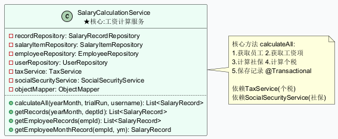

**属性说明：**

| 属性名称 | 数据类型 | 可见性 | 说明 |
|---------|---------|--------|------|
| recordRepository | SalaryRecordRepository | private (final) | 工资记录仓库，Spring 注入 |
| salaryItemRepository | SalaryItemRepository | private (final) | 工资项目仓库，Spring 注入 |
| employeeRepository | EmployeeRepository | private (final) | 员工仓库，Spring 注入 |
| userRepository | UserRepository | private (final) | 用户仓库，Spring 注入 |
| taxService | TaxService | private (final) | 个税服务，Spring 注入 |
| socialSecurityService | SocialSecurityService | private (final) | 社保服务，Spring 注入 |
| objectMapper | ObjectMapper | private (final) | Jackson JSON 处理器，序列化工资项明细 |

**操作说明：**

| 操作名称 | 参数说明 | 返回值 | 说明 |
|---------|---------|-------|------|
| calculateAll | yearMonth: String - 年月(yyyyMM); trialRun: boolean - 是否试算; username: String - 操作人用户名 | List\<SalaryRecord\> | 工资计算主入口。1.获取员工清单 2.获取工资项 3.计算社保 4.计算个税 5.保存记录。@Transactional |
| getRecords | yearMonth: String - 年月; departmentId: Long - 部门ID(可选) | List\<SalaryRecord\> | 按年月(与部门)查询工资记录 |
| getEmployeeRecords | employeeId: Long - 员工ID | List\<SalaryRecord\> | 查询某员工的历史工资记录（按年月降序） |
| getEmployeeMonthRecord | employeeId: Long - 员工ID; yearMonth: String - 年月 | SalaryRecord | 查询某员工某月的工资记录 |

---

### 2.5 TaxService（个税服务）

**UML 表示：**

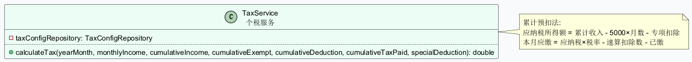

**属性说明：**

| 属性名称 | 数据类型 | 可见性 | 说明 |
|---------|---------|--------|------|
| taxConfigRepository | TaxConfigRepository | private (final) | 个税税率仓库，Spring 注入 |

**操作说明：**

| 操作名称 | 参数说明 | 返回值 | 说明 |
|---------|---------|-------|------|
| calculateTax | yearMonth: String - 年月; monthlyIncome: double - 本月应纳税所得额; cumulativeIncome: double - 累计收入; cumulativeExempt: double - 累计免税; cumulativeDeduction: double - 累计扣除; cumulativeTaxPaid: double - 累计已缴税; specialDeduction: double - 专项附加扣除 | double | 采用**累计预扣法**计算本月应缴个税。算法：累计应纳税所得额 = 累计收入 - 累计免税 - 累计减除费用(5000×月数) - 累计专项扣除；本月应缴 = 累计应纳税额 × 税率 - 速算扣除数 - 累计已缴 |

---

### 2.6 SocialSecurityService（社保服务）

**UML 表示：**

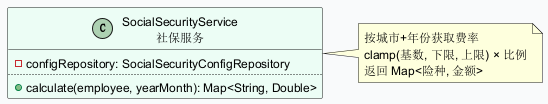

**属性说明：**

| 属性名称 | 数据类型 | 可见性 | 说明 |
|---------|---------|--------|------|
| configRepository | SocialSecurityConfigRepository | private (final) | 社保配置仓库，Spring 注入 |

**操作说明：**

| 操作名称 | 参数说明 | 返回值 | 说明 |
|---------|---------|-------|------|
| calculate | employee: Employee - 员工实体; yearMonth: String - 年月(yyyyMM) | Map\<String, Double\> | 计算社保公积金个人缴纳金额。根据员工社保城市和年份获取配置。按险种分别计算：缴纳金额 = clamp(基数, 下限, 上限) × 比例。返回 Map 包含 endowment/medical/unemployment/housingFund 等项的金额 |

---

### 2.7 ExcelService（Excel 导入导出服务）

**UML 表示：**

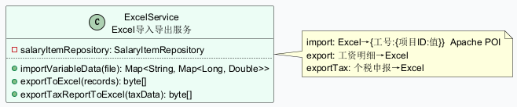

**属性说明：**

| 属性名称 | 数据类型 | 可见性 | 说明 |
|---------|---------|--------|------|
| salaryItemRepository | SalaryItemRepository | private (final) | 工资项目仓库，Spring 注入 |

**操作说明：**

| 操作名称 | 参数说明 | 返回值 | 说明 |
|---------|---------|-------|------|
| importVariableData | file: MultipartFile - 上传的 Excel 文件 | Map\<String, Map\<Long, Double\>\> | 导入考勤扣款、绩效等可变数据。第一列为工号，后续列为项目值。返回 Map{工号 → Map{项目ID → 值}} |
| exportToExcel | records: List\<SalaryRecord\> - 工资记录列表 | byte[] | 导出工资明细 Excel。列：工号、姓名、部门、应发合计、个税、社保、公积金、实发合计 |
| exportTaxReportToExcel | taxData: List\<Map\> - 个税申报数据 | byte[] | 导出个税申报 Excel。动态列头映射自 Map 的 key |

---

### 2.8 PayslipService（工资条服务）

**UML 表示：**

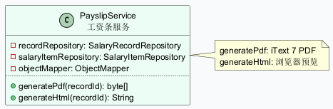

**属性说明：**

| 属性名称 | 数据类型 | 可见性 | 说明 |
|---------|---------|--------|------|
| recordRepository | SalaryRecordRepository | private (final) | 工资记录仓库，Spring 注入 |
| salaryItemRepository | SalaryItemRepository | private (final) | 工资项目仓库，Spring 注入 |
| objectMapper | ObjectMapper | private (final) | Jackson JSON 处理器 |

**操作说明：**

| 操作名称 | 参数说明 | 返回值 | 说明 |
|---------|---------|-------|------|
| generatePdf | recordId: Long - 工资记录ID | byte[] | 生成 PDF 格式工资条。使用 iText 7 库，包含员工信息、工资明细、汇总金额 |
| generateHtml | recordId: Long - 工资记录ID | String | 生成 HTML 格式工资条预览。包含工资表头、分项明细、应发/扣款/实发合计 |

---

### 2.9 ReportService（报表服务）

**UML 表示：**

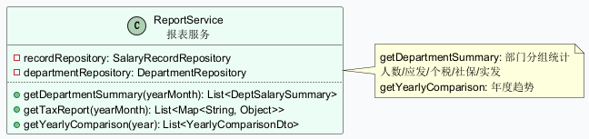

**属性说明：**

| 属性名称 | 数据类型 | 可见性 | 说明 |
|---------|---------|--------|------|
| recordRepository | SalaryRecordRepository | private (final) | 工资记录仓库，Spring 注入 |
| departmentRepository | DepartmentRepository | private (final) | 部门仓库，Spring 注入 |

**操作说明：**

| 操作名称 | 参数说明 | 返回值 | 说明 |
|---------|---------|-------|------|
| getDepartmentSummary | yearMonth: String - 年月(yyyyMM) | List\<DeptSalarySummary\> | 按部门汇总工资数据。分组统计人数、应发合计、个税、社保、公积金、实发合计 |
| getTaxReport | yearMonth: String - 年月(yyyyMM) | List\<Map\<String, Object\>\> | 生成个税申报表数据。含姓名、身份证号、累计收入、累计扣除、本月应缴等信息 |
| getYearlyComparison | year: String - 年份(yyyy) | List\<YearlyComparisonDto\> | 年度对比分析。按部门×月份统计应发和实发数据 |

---

### 2.10 OperationLogService（日志服务）

**UML 表示：**

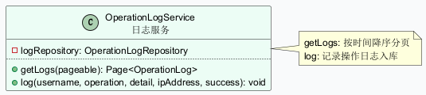

**属性说明：**

| 属性名称 | 数据类型 | 可见性 | 说明 |
|---------|---------|--------|------|
| logRepository | OperationLogRepository | private (final) | 操作日志仓库，Spring 注入 |

**操作说明：**

| 操作名称 | 参数说明 | 返回值 | 说明 |
|---------|---------|-------|------|
| getLogs | pageable: Pageable - 分页参数 | Page\<OperationLog\> | 分页查询操作日志（按创建时间降序） |
| log | username: String - 操作用户; operation: String - 操作类型; detail: String - 详情; ipAddress: String - IP地址; success: boolean - 是否成功 | void | 记录一条操作日志到数据库 |

---

### 2.11 DataInitializer（数据初始化器）

**UML 表示：**

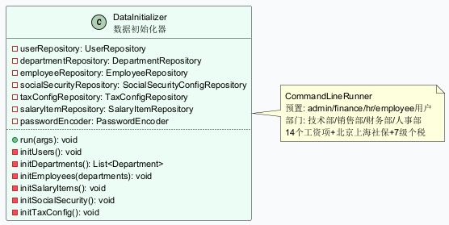

**属性说明：**

| 属性名称 | 数据类型 | 可见性 | 说明 |
|---------|---------|--------|------|
| userRepository | UserRepository | private (final) | 用户仓库 |
| departmentRepository | DepartmentRepository | private (final) | 部门仓库 |
| employeeRepository | EmployeeRepository | private (final) | 员工仓库 |
| socialSecurityRepository | SocialSecurityConfigRepository | private (final) | 社保配置仓库 |
| taxConfigRepository | TaxConfigRepository | private (final) | 税率仓库 |
| salaryItemRepository | SalaryItemRepository | private (final) | 工资项目仓库 |
| passwordEncoder | PasswordEncoder | private (final) | BCrypt 密码编码器 |

**操作说明：**

| 操作名称 | 参数说明 | 返回值 | 说明 |
|---------|---------|-------|------|
| run | args: String... - 命令行参数 | void | CommandLineRunner 实现。启动时执行，检查数据库是否已初始化 |
| initUsers | 无参数 | void | 创建预置用户：admin/admin123(管理员)、finance/finance123(财务)、hr/hr123(人事)、employee1~2/emp123(员工) |
| initDepartments | 无参数 | List\<Department\> | 创建部门：技术部(含前端组/后端组)、销售部、财务部、人事部 |
| initEmployees | departments: List\<Department\> - 部门列表 | void | 创建预置员工：张三/李四(技术部-北京)、王五(销售部-上海)、赵六(财务部-北京) |
| initSalaryItems | 无参数 | void | 创建 14 个工资项目：基本工资、年功工资、效益工资、岗位工资、高温补贴、通讯补助、考勤扣款、应发合计(公式)、养老保险、医疗保险、失业保险、住房公积金、个人所得税、实发合计 |
| initSocialSecurity | 无参数 | void | 创建北京/上海 2024 年社保公积金费率配置（养老/医疗/失业/工伤/生育/公积金 各含个人和单位比例） |
| initTaxConfig | 无参数 | void | 创建 2024 年个税 7 级累进税率表（3%~45%） |

---

## 第三类：控制类 (Controller)

### 3.1 AuthController（认证控制）

**请求映射：** `/api/auth`

**UML 表示：**

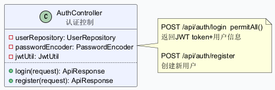

**属性说明：**

| 属性名称 | 数据类型 | 可见性 | 说明 |
|---------|---------|--------|------|
| userRepository | UserRepository | private (final) | 用户数据仓库 |
| passwordEncoder | PasswordEncoder | private (final) | BCrypt 密码编码器 |
| jwtUtil | JwtUtil | private (final) | JWT 令牌工具类 |

**操作说明：**

| 操作名称 | HTTP 方法 + 路径 | 参数 | 返回值 | 权限 | 说明 |
|---------|----------------|------|-------|------|------|
| login | POST /api/auth/login | @Valid @RequestBody LoginRequest: username + password | ApiResponse\<Map\> → {token, username, realName, role} | permitAll() | 用户登录。验证用户名密码，成功后返回 JWT 令牌和用户信息 |
| register | POST /api/auth/register | @Valid @RequestBody LoginRequest: username + password | ApiResponse ("注册成功") | permitAll() | 用户注册。检查用户名唯一性，创建新用户（默认角色 EMPLOYEE） |

---

### 3.2 DepartmentController（部门控制）

**请求映射：** `/api/departments`

**UML 表示：**

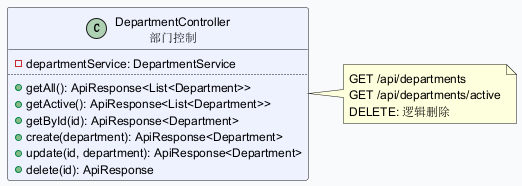

**属性说明：**

| 属性名称 | 数据类型 | 可见性 | 说明 |
|---------|---------|--------|------|
| departmentService | DepartmentService | private (final) | 部门业务服务 |

**操作说明：**

| 操作名称 | HTTP 方法 + 路径 | 参数 | 返回值 | 说明 |
|---------|----------------|------|-------|------|
| getAll | GET /api/departments | 无 | ApiResponse\<List\<Department\>\> | 获取所有部门列表（树形结构） |
| getActive | GET /api/departments/active | 无 | ApiResponse\<List\<Department\>\> | 获取所有启用的部门 |
| getById | GET /api/departments/{id} | @PathVariable id: Long | ApiResponse\<Department\> | 根据 ID 获取部门详情 |
| create | POST /api/departments | @RequestBody Department | ApiResponse\<Department\> | 创建新部门 |
| update | PUT /api/departments/{id} | @PathVariable id: Long, @RequestBody Department | ApiResponse\<Department\> | 更新部门信息 |
| delete | DELETE /api/departments/{id} | @PathVariable id: Long | ApiResponse ("删除成功") | 逻辑删除部门 |

---

### 3.3 EmployeeController（员工控制）

**请求映射：** `/api/employees`

**UML 表示：**

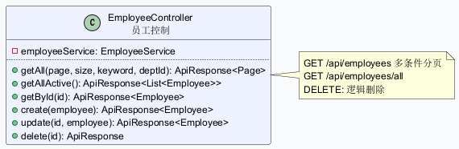

**属性说明：**

| 属性名称 | 数据类型 | 可见性 | 说明 |
|---------|---------|--------|------|
| employeeService | EmployeeService | private (final) | 员工业务服务 |

**操作说明：**

| 操作名称 | HTTP 方法 + 路径 | 参数 | 返回值 | 说明 |
|---------|----------------|------|-------|------|
| getAll | GET /api/employees | @RequestParam(可选) page, size, keyword, departmentId | ApiResponse\<Page\<Employee\>\> | 多条件分页查询员工 |
| getAllActive | GET /api/employees/all | 无 | ApiResponse\<List\<Employee\>\> | 获取所有在职员工 |
| getById | GET /api/employees/{id} | @PathVariable id: Long | ApiResponse\<Employee\> | 根据 ID 获取员工详情 |
| create | POST /api/employees | @RequestBody Employee | ApiResponse\<Employee\> | 创建新员工 |
| update | PUT /api/employees/{id} | @PathVariable id: Long, @RequestBody Employee | ApiResponse\<Employee\> | 更新员工信息 |
| delete | DELETE /api/employees/{id} | @PathVariable id: Long | ApiResponse ("删除成功") | 逻辑删除员工 |

---

### 3.4 SalaryItemController（工资项目控制）

**请求映射：** `/api/salary-items`

**UML 表示：**

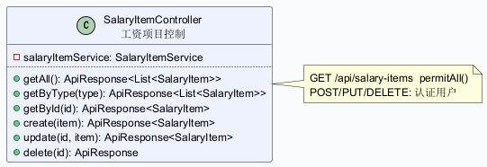

**属性说明：**

| 属性名称 | 数据类型 | 可见性 | 说明 |
|---------|---------|--------|------|
| salaryItemService | SalaryItemService | private (final) | 工资项目业务服务 |

**操作说明：**

| 操作名称 | HTTP 方法 + 路径 | 参数 | 返回值 | 权限 | 说明 |
|---------|----------------|------|-------|------|------|
| getAll | GET /api/salary-items | 无 | ApiResponse\<List\<SalaryItem\>\> | permitAll() for GET | 获取所有启用的工资项目 |
| getByType | GET /api/salary-items/type/{type} | @PathVariable type: String | ApiResponse\<List\<SalaryItem\>\> | permitAll() for GET | 按类型获取工资项目（EARNING/DEDUCTION 等） |
| getById | GET /api/salary-items/{id} | @PathVariable id: Long | ApiResponse\<SalaryItem\> | permitAll() for GET | 获取单个工资项目详情 |
| create | POST /api/salary-items | @RequestBody SalaryItem | ApiResponse\<SalaryItem\> | 认证用户 | 创建新工资项目 |
| update | PUT /api/salary-items/{id} | @PathVariable id: Long, @RequestBody SalaryItem | ApiResponse\<SalaryItem\> | 认证用户 | 更新工资项目信息 |
| delete | DELETE /api/salary-items/{id} | @PathVariable id: Long | ApiResponse ("删除成功") | 认证用户 | 逻辑删除工资项目 |

---

### 3.5 PayrollController（工资核算控制）

**请求映射：** `/api/payroll`

**UML 表示：**

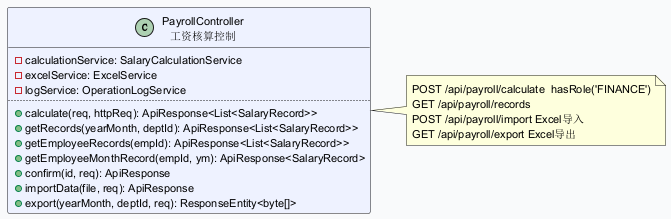

**属性说明：**

| 属性名称 | 数据类型 | 可见性 | 说明 |
|---------|---------|--------|------|
| calculationService | SalaryCalculationService | private (final) | 工资计算服务 |
| excelService | ExcelService | private (final) | Excel 导入导出服务 |
| logService | OperationLogService | private (final) | 操作日志服务 |

**操作说明：**

| 操作名称 | HTTP 方法 + 路径 | 参数 | 返回值 | 权限 | 说明 |
|---------|----------------|------|-------|------|------|
| calculate | POST /api/payroll/calculate | @RequestBody SalaryCalculationRequest: yearMonth, trialRun, variableValues | ApiResponse\<List\<SalaryRecord\>\> | @PreAuthorize hasRole('FINANCE') | 工资计算主入口。接收年月、是否试算、变量值，返回工资记录列表 |
| getRecords | GET /api/payroll/records | @RequestParam yearMonth, departmentId(可选) | ApiResponse\<List\<SalaryRecord\>\> | hasAnyRole('ADMIN','FINANCE','HR') | 按年月和部门查询工资记录 |
| getEmployeeRecords | GET /api/payroll/records/employee/{employeeId} | @PathVariable employeeId: Long | ApiResponse\<List\<SalaryRecord\>\> | 认证用户 | 查询某员工历史工资记录 |
| getEmployeeMonthRecord | GET /api/payroll/records/employee/{employeeId}/{yearMonth} | @PathVariable employeeId, @PathVariable yearMonth | ApiResponse\<SalaryRecord\> | 认证用户 | 查询某员工某月工资记录 |
| confirm | POST /api/payroll/records/{id}/confirm | @PathVariable id: Long | ApiResponse ("确认成功") | hasRole('FINANCE') | 确认工资记录（标记为 CONFIRMED） |
| importData | POST /api/payroll/import | @RequestParam file: MultipartFile | ApiResponse (导入数据) | hasRole('FINANCE') | 导入 Excel 可变数据（考勤扣款等） |
| export | GET /api/payroll/export | @RequestParam yearMonth, departmentId(可选) | ResponseEntity\<byte[]\> → Excel 文件 | hasAnyRole('ADMIN','FINANCE') | 导出工资明细 Excel |

---

### 3.6 PayslipController（工资条控制）

**请求映射：** `/api/payslips`

**UML 表示：**

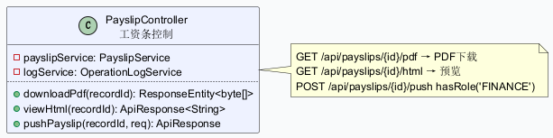

**属性说明：**

| 属性名称 | 数据类型 | 可见性 | 说明 |
|---------|---------|--------|------|
| payslipService | PayslipService | private (final) | 工资条服务 |
| logService | OperationLogService | private (final) | 操作日志服务 |

**操作说明：**

| 操作名称 | HTTP 方法 + 路径 | 参数 | 返回值 | 权限 | 说明 |
|---------|----------------|------|-------|------|------|
| downloadPdf | GET /api/payslips/{recordId}/pdf | @PathVariable recordId: Long | ResponseEntity\<byte[]\> → PDF 文件 | 认证用户 | 下载 PDF 格式工资条 |
| viewHtml | GET /api/payslips/{recordId}/html | @PathVariable recordId: Long | ApiResponse\<String\> (HTML代码) | 认证用户 | 获取 HTML 格式工资条预览 |
| pushPayslip | POST /api/payslips/{recordId}/push | @PathVariable recordId: Long | ApiResponse ("推送成功") | @PreAuthorize hasRole('FINANCE') | 推送工资条给员工 |

---

### 3.7 ReportController（报表控制）

**请求映射：** `/api/reports`

**UML 表示：**

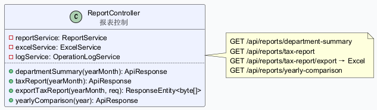

**属性说明：**

| 属性名称 | 数据类型 | 可见性 | 说明 |
|---------|---------|--------|------|
| reportService | ReportService | private (final) | 报表服务 |
| excelService | ExcelService | private (final) | Excel 导出服务 |
| logService | OperationLogService | private (final) | 操作日志服务 |

**操作说明：**

| 操作名称 | HTTP 方法 + 路径 | 参数 | 返回值 | 权限 | 说明 |
|---------|----------------|------|-------|------|------|
| departmentSummary | GET /api/reports/department-summary | @RequestParam yearMonth: String | ApiResponse\<List\<DeptSalarySummary\>\> | hasAnyRole('ADMIN','FINANCE','HR') | 部门工资汇总报表 |
| taxReport | GET /api/reports/tax-report | @RequestParam yearMonth: String | ApiResponse\<List\<Map\>\> | hasAnyRole('ADMIN','FINANCE') | 个税申报表数据 |
| exportTaxReport | GET /api/reports/tax-report/export | @RequestParam yearMonth: String | ResponseEntity\<byte[]\> → Excel 文件 | hasAnyRole('ADMIN','FINANCE') | 导出个税申报 Excel |
| yearlyComparison | GET /api/reports/yearly-comparison | @RequestParam year: String | ApiResponse\<List\<YearlyComparisonDto\>\> | hasAnyRole('ADMIN','FINANCE') | 年度工资对比分析 |

---

### 3.8 SystemController（系统管理控制）

**请求映射：** `/api/system`

**UML 表示：**

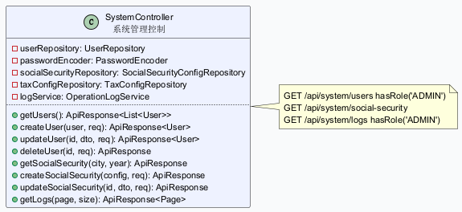

**属性说明：**

| 属性名称 | 数据类型 | 可见性 | 说明 |
|---------|---------|--------|------|
| userRepository | UserRepository | private (final) | 用户数据仓库 |
| passwordEncoder | PasswordEncoder | private (final) | BCrypt 密码编码器 |
| socialSecurityRepository | SocialSecurityConfigRepository | private (final) | 社保配置仓库 |
| taxConfigRepository | TaxConfigRepository | private (final) | 个税税率仓库 |
| logService | OperationLogService | private (final) | 操作日志服务 |

**操作说明：**

| 操作名称 | HTTP 方法 + 路径 | 参数 | 返回值 | 权限 | 说明 |
|---------|----------------|------|-------|------|------|
| getUsers | GET /api/system/users | 无 | ApiResponse\<List\<User\>\> | hasRole('ADMIN') | 获取所有用户 |
| createUser | POST /api/system/users | @RequestBody User, HttpServletRequest | ApiResponse\<User\> | hasRole('ADMIN') | 创建新用户（密码自动 BCrypt 加密） |
| updateUser | PUT /api/system/users/{id} | @PathVariable id, @RequestBody User | ApiResponse\<User\> | hasRole('ADMIN') | 更新用户信息 |
| deleteUser | DELETE /api/system/users/{id} | @PathVariable id, HttpServletRequest | ApiResponse ("删除成功") | hasRole('ADMIN') | 删除用户 |
| getSocialSecurity | GET /api/system/social-security | @RequestParam(可选) city, year | ApiResponse\<List\<SocialSecurityConfig\>\> | hasAnyRole('ADMIN','FINANCE') | 查询社保配置 |
| createSocialSecurity | POST /api/system/social-security | @RequestBody SocialSecurityConfig | ApiResponse\<SocialSecurityConfig\> | hasRole('FINANCE') | 新增社保配置 |
| updateSocialSecurity | PUT /api/system/social-security/{id} | @PathVariable id, @RequestBody SocialSecurityConfig | ApiResponse\<SocialSecurityConfig\> | hasRole('FINANCE') | 修改社保配置 |
| getLogs | GET /api/system/logs | @RequestParam page(默认0), size(默认20) | ApiResponse\<Page\<OperationLog\>\> | hasRole('ADMIN') | 分页查看操作日志 |

---

### 3.9 IndexController（首页控制）

**UML 表示：**

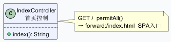

**操作说明：**

| 操作名称 | HTTP 方法 + 路径 | 参数 | 返回值 | 权限 | 说明 |
|---------|----------------|------|-------|------|------|
| index | GET / | 无 | ModelAndView → forward to `/index.html` | permitAll() | 转发到 SPA 前端入口页面 |

---

## 附录：类统计汇总

| 分类 | 类名 | 属性数 | 操作数 | 所属包 |
|------|------|--------|--------|--------|
| **实体** | Department | 9 | 2 | com.salary.module.org.domain |
| | Employee | 15 | 2 | com.salary.module.org.domain |
| | User | 10 | 2 | com.salary.module.system.domain |
| | SalaryItem | 8 | 0 | com.salary.module.salary.item.domain |
| | SalaryRecord | 16 | 2 | com.salary.module.salary.calculation.domain |
| | SocialSecurityConfig | 9 | 0 | com.salary.module.system.domain |
| | TaxConfig | 8 | 0 | com.salary.module.system.domain |
| | OperationLog | 7 | 1 | com.salary.module.system.domain |
| **服务** | DepartmentService | 1 | 6 | com.salary.module.org.service |
| | EmployeeService | 2 | 6 | com.salary.module.org.service |
| | SalaryItemService | 1 | 6 | com.salary.module.salary.item |
| | SalaryCalculationService | 7 | 4 | com.salary.module.salary.calculation.service |
| | TaxService | 1 | 1 | com.salary.module.salary.calculation.service |
| | SocialSecurityService | 1 | 1 | com.salary.module.salary.calculation.service |
| | ExcelService | 1 | 3 | com.salary.module.salary.calculation.service |
| | PayslipService | 3 | 2 | com.salary.module.salary.payslip |
| | ReportService | 2 | 3 | com.salary.module.report |
| | OperationLogService | 1 | 2 | com.salary.module.system.service |
| | DataInitializer | 7 | 7 | com.salary.common.config |
| **控制** | AuthController | 3 | 2 | com.salary.module.auth |
| | DepartmentController | 1 | 6 | com.salary.module.org.controller |
| | EmployeeController | 1 | 6 | com.salary.module.org.controller |
| | SalaryItemController | 1 | 6 | com.salary.module.salary.item |
| | PayrollController | 3 | 7 | com.salary.module.salary.calculation.controller |
| | PayslipController | 2 | 3 | com.salary.module.salary.payslip |
| | ReportController | 3 | 4 | com.salary.module.report |
| | SystemController | 5 | 8 | com.salary.module.system.controller |
| | IndexController | 0 | 1 | com.salary.module.auth |

---

*文档生成日期：2026-06-23*
*对应代码版本：薪资管理系统 v1.0.0*
