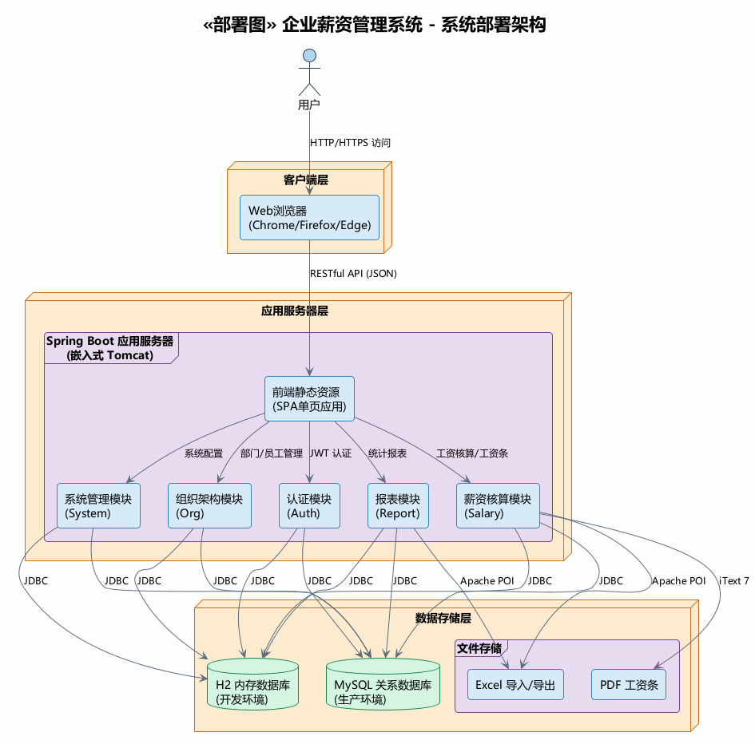

# 系统部署说明

## 1. 系统部署图

---

## 2. 部署架构概述

本系统采用基于 Spring Boot 的典型三层 Web 应用部署架构，将系统划分为三个逻辑层：客户端层、应用服务器层和数据存储层。各层之间通过标准协议进行通信，层内部可独立扩展和维护。

客户端层采用 Web 浏览器（Chrome、Firefox、Edge 等现代浏览器），通过 HTTP/HTTPS 协议访问系统。应用服务器层基于 Spring Boot 3.2 框架，内嵌 Tomcat 服务器，对外提供 RESTful API 接口，数据格式为 JSON。数据存储层在开发环境使用 H2 内存数据库，生产环境切换为 MySQL 关系数据库，通过 JDBC 协议通信。

---

## 3. 客户端层

### 3.1 部署节点

客户端层即用户的 Web 浏览器，可以在 Windows、macOS 或 Linux 操作系统上运行，要求浏览器支持 ES6+ 标准。用户通过浏览器访问系统 URL，无需安装任何额外插件或客户端软件。网络方面，客户端需要能够访问应用服务器的地址，可以是域名或 IP 地址。

### 3.2 功能说明

前端采用纯 SPA（单页应用）架构，使用原生 HTML、CSS 和 JavaScript 实现，不依赖任何前端框架。页面路由由前端 JavaScript 控制，共有 8 个功能页面，包括工作台、部门管理、员工管理、工资项目、工资核算、工资条、统计报表和系统设置。

前端通过 api.js 封装的 fetch 异步请求调用后端 RESTful 接口。登录成功后获取 JWT Token，存储于浏览器的 localStorage 中，每次请求自动在请求头中携带 Authorization: Bearer Token 进行身份认证。

---

## 4. 应用服务器层

### 4.1 部署节点

应用服务器可以部署在 Windows Server 或 Linux（CentOS/Ubuntu）操作系统上，推荐配置为 2 核 CPU 和 4GB 内存。服务器需要安装 JDK 17 或更高版本的 Java 运行时环境，最低需要 512MB 堆内存。应用以独立 JAR 包形式部署，通过 java -jar 命令启动，内嵌 Tomcat 容器，无需额外安装 Web 服务器。

### 4.2 内部模块结构

应用服务器内部按业务功能划分为 6 个模块，遵循 Controller → Service → Repository 的分层架构。

认证模块（Auth）位于 com.salary.module.auth 包下，负责用户登录认证和 JWT 令牌生成，以及首页访问控制。

组织架构模块（Org）位于 com.salary.module.org 包下，提供部门管理功能，支持自关联树形结构维护，以及员工信息的增删改查和分页查询。

薪资核算模块（Salary）位于 com.salary.module.salary 包下，功能最为复杂，包括工资项目定义、工资计算（采用个税累计预扣法算法）、工资条生成（支持 PDF 和 HTML 格式）以及 Excel 文件的导入导出。

报表模块（Report）位于 com.salary.module.report 包下，提供部门薪资汇总、个税申报表和年度对比分析等统计报表功能。

系统管理模块（System）位于 com.salary.module.system 包下，管理系统用户、社保公积金配置、个税税率配置和操作审计日志。

基础设施层（Common）位于 com.salary.common 包下，提供全局安全配置，包括 JWT 过滤器和 Spring Security 集成、全局异常处理、CORS 跨域配置和数据初始化功能。

### 4.3 Spring Boot 配置说明

应用服务端口默认为 8080，可通过 --server.port 参数指定。开发环境使用 H2 内存数据库，JPA DDL 策略为 create，每次启动时重建表结构。生产环境需切换为 MySQL 数据库，DDL 策略改为 update 以保留数据。

日志方面，开发环境 com.salary 包日志级别为 info，生产环境建议调整为 warn。JWT 密钥在开发环境中使用开发密钥，生产环境必须修改为专用的随机密钥，长度至少 256 位。JWT 过期时间默认为 24 小时（86400000 毫秒），可根据安全策略调整。Open-in-view 配置为 true，确保在视图渲染阶段 Hibernate 会话保持开启。

### 4.4 环境配置切换

生产环境部署时需要修改 application.yml 中的数据库配置。数据库连接地址改为 MySQL 的 JDBC 连接串，驱动类改为 com.mysql.cj.jdbc.Driver，配置数据库用户名和密码。JPA 的 DDL 策略改为 update，同时关闭 SQL 日志输出。JWT 密钥必须替换为生产环境的专用密钥。

---

## 5. 数据存储层

### 5.1 数据库节点

开发环境使用 H2 内存数据库，连接地址为 jdbc:h2:mem:salary_db，数据不持久化，应用重启后数据丢失。开发环境下可通过 /h2-console 访问数据库控制台进行调试。

生产环境使用 MySQL 5.7 及以上版本，数据持久化到磁盘存储。需要配置数据库备份策略，建议每日自动备份加定期手动导出。

### 5.2 数据库表清单

系统共包含 8 张业务数据表。sys_user 属于系统管理模块，存储系统用户信息，包含角色字段，角色枚举值为 ADMIN、FINANCE、HR 和 EMPLOYEE。sys_department 属于组织架构模块，存储部门信息，通过自关联实现树形结构。sys_employee 属于组织架构模块，存储员工信息，共 16 个字段，包含社保基数等薪酬相关数据。

sys_salary_item 属于薪资核算模块，存储工资项目定义，支持公式配置。sal_salary_record 属于薪资核算模块，是核心业务表，共 18 个字段，记录每次工资核算的完整数据。sys_social_security_config 属于系统管理模块，按城市和年度维度存储社保公积金缴纳比例。sys_tax_config 属于系统管理模块，存储个税税率表，包含速算扣除数。sys_operation_log 属于系统管理模块，记录用户操作审计日志。

### 5.3 文件存储节点

系统涉及两类文件存储。Excel 文件用于工资数据的导入和报表导出，依赖 Apache POI 5.2.5 库，文件在用户下载后存储到本地。PDF 文件用于工资条生成和推送，依赖 iText 7 库，同样在用户下载后存储到本地。

---

## 6. 通信协议与交互流程

### 6.1 客户端到应用服务器

用户在前端界面进行操作后，浏览器通过 fetch 函数发起 HTTP 请求，请求方法包括 POST、GET、PUT 和 DELETE。请求头中 Content-Type 设置为 application/json，Authorization 头携带 Bearer JWT Token。服务器处理完成后返回 JSON 格式的响应，包含 success、message 和 data 三个字段。

### 6.2 应用服务器到数据库

Controller 接收客户端请求后，调用 Service 层执行业务逻辑，Service 层通过 Repository 接口（Spring Data JPA）进行数据访问。Hibernate ORM 框架负责对象关系映射，通过 JDBC 连接池与数据库交互执行 SQL。

### 6.3 认证流程

用户发送登录请求到 /api/auth/login 接口，服务器校验用户名和密码后，通过 JwtUtil 生成包含用户名和角色的 JWT Token，返回给前端。前端将 Token 存储到 localStorage 中。后续每次请求由 JwtAuthFilter 过滤器拦截，解析 Token 并设置 Spring SecurityContext，然后通过 @PreAuthorize 注解进行方法级别的权限校验，最后执行业务逻辑。

---

## 7. 安全部署要求

网络方面，应用服务器应部署在内网，不直接暴露到公网。生产环境必须启用 HTTPS，推荐使用 Nginx 反向代理加 SSL 证书的方式。生产环境的 JWT 密钥必须修改为至少 256 位的随机字符串。

密码存储使用 BCrypt 加密算法，由 Spring Security 的 BCryptPasswordEncoder 实现。权限控制采用方法级别的 RBAC 模型，通过 @PreAuthorize 注解实现角色校验。

CORS 配置在生产环境中应限制为具体的域名，避免使用通配符。H2 数据库控制台在生产环境中必须禁用。SQL 注入防护由 JPA 的预编译参数化查询机制自动保障，无需额外配置。

---

## 8. 部署命令与启动步骤

### 8.1 构建命令

开发环境构建使用 mvn clean package -DskipTests 命令，跳过测试以加快构建速度。生产环境构建可以使用 mvn clean package -DskipTests -Pproduction 命令，激活生产环境配置。

### 8.2 启动命令

开发环境直接使用 java -jar target/salary-management-system-1.0.0.jar 启动。生产环境可以通过 --server.port 和 --spring.profiles.active 参数指定端口和环境配置。Linux 系统下推荐使用 nohup 命令后台启动，并将日志输出到文件。Windows 系统下可以使用 javaw 命令后台启动。

### 8.3 Nginx 反向代理配置

生产环境推荐使用 Nginx 反向代理。在 Nginx 配置文件中监听 443 端口并配置 SSL 证书，将请求代理转发到本地 8080 端口的 Spring Boot 应用。需要设置 Host、X-Real-IP、X-Forwarded-For 和 X-Forwarded-Proto 等代理头信息，同时设置客户端请求体大小为 10MB。

### 8.4 启动验证

应用启动后，通过浏览器访问根路径可看到前端登录页面，向 /api/auth/login 发送 POST 请求可验证 API 是否正常工作。开发环境下还可以通过 /h2-console 访问数据库控制台进行检查。
